```{r setup, include=FALSE}
library(connectwidgets)
library(dplyr)
library(connectwidgets)
library(connectapi)

knitr::opts_chunk$set(echo = FALSE, message = FALSE, warning = FALSE)

client <- connect(
  server  = Sys.getenv("CONNECT_SERVER"),
  api_key = Sys.getenv("CONNECT_API_KEY")
  )


guids <- c("2d8fff75-ec0d-4046-9079-b249783106e3", #AQI ETL
           "c6463de2-4d19-4167-a131-712a8975bdd6", #ad-hoc distill curation
           "80cd253a-79b5-40bb-80d1-5793c686ef98", #ad-hoc scan data
           "4dbf890d-ce99-4a3e-bacf-504bf81dabd0", #ad-hoc validation agent
           "d6d38ba4-bd5e-48ba-a896-376d6f0574c5" #ad-hoc data dictionary
           )

pointblank_content <- client %>%
  connectapi::get_content(.p = ~ .x$guid %in% guids) %>% 
  rename("url" = content_url) %>% 
  mutate("owner_username" = "katie") %>% 
  rename("updated_time" = "last_deployed_time")
  


```

+----------------------------+---------------------------------------------------------------------------------------------------------------------------------------------------------------------------------------------+
| {width="200"} | The assets below represent two sample use cases for [`pointblank`](https://github.com/rich-iannone/pointblank):                                                                             |
|                            |                                                                                                                                                                                             |
|                            | -   Ad hoc analysis - let's explore a new data set, establish some validation rules, and build a data dictionary as part of our overall documentation                                       |
|                            |                                                                                                                                                                                             |
|                            | -   A scheduled ETL process - daily air quality readings are monitored with pointblank and an email report is generated indicating whether the values are above or below a threshold value. |
+----------------------------+---------------------------------------------------------------------------------------------------------------------------------------------------------------------------------------------+

### Ad hoc analysis - bird strikes `r emo::ji("eagle")`

```{r grid}
pointblank_content %>%
  slice(-1) %>%
  rsc_grid()
```

### ETL process - Air Quality daily report `r emo::ji("fog")`

```{r card}
pointblank_content %>%
  slice(1) %>%
  rsc_card()
```
